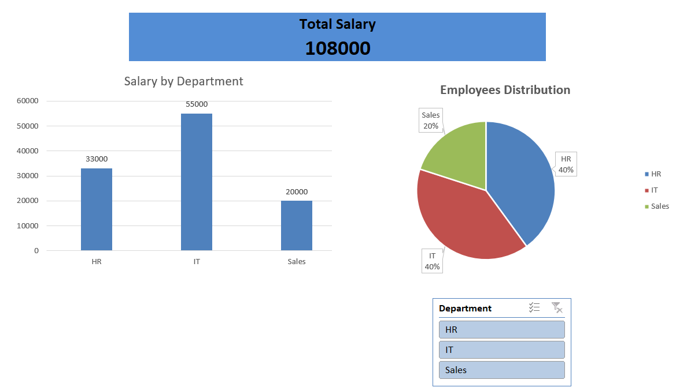

## Dashboard Preview

# Excel Dashboard Project

## Overview

This project presents an interactive Excel dashboard designed to analyze employee salary and department-wise distribution. It enables quick insights using visualizations and dynamic filtering.

## Tools Used

* Microsoft Excel
* Pivot Tables
* Charts (Bar & Pie)
* Slicer (for filtering)

## Features

* Total Salary KPI
* Salary by Department (Bar Chart)
* Employee Distribution (Pie Chart)
* Interactive Department Filter (Slicer)

## Insights

* IT department has the highest total salary
* Employee distribution is balanced across departments

## File

* employee-dashboard.xlsx
